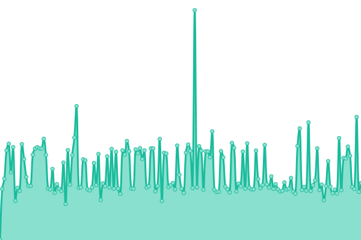
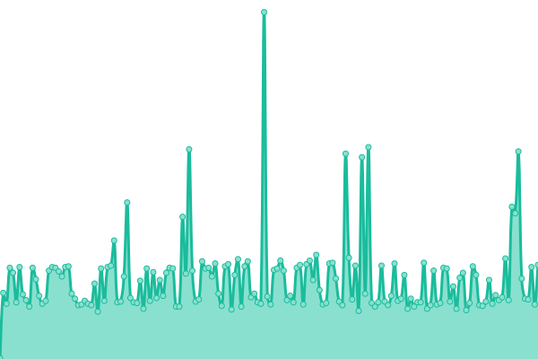
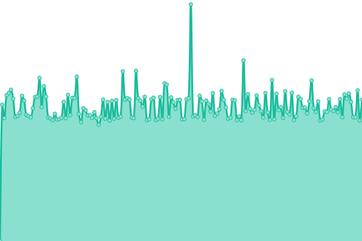
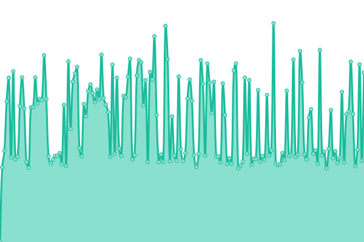

# [📈 Live Status](https://StarCitizenTools.github.io/upptime): <!--live status--> **🟥 Complete outage**

This repository contains the open-source uptime monitor and status page for [StarCitizen.tools](https://starcitizen.tools), powered by [Upptime](https://github.com/upptime/upptime).

With [Upptime](https://upptime.js.org), you can get your own unlimited and free uptime monitor and status page, powered entirely by a GitHub repository. We use [Issues](https://github.com/StarCitizenTools/upptime/issues) as incident reports, [Actions](https://github.com/StarCitizenTools/upptime/actions) as uptime monitors, and [Pages](https://StarCitizenTools.github.io/upptime) for the status page.

<!--start: status pages-->
<!-- This summary is generated by Upptime (https://github.com/upptime/upptime) -->
<!-- Do not edit this manually, your changes will be overwritten -->
<!-- prettier-ignore -->
| URL | Status | History | Response Time | Uptime |
| --- | ------ | ------- | ------------- | ------ |
|  [Wiki](https://starcitizen.tools) | 🟥 Down | [wiki.yml](https://github.com/StarCitizenTools/upptime/commits/HEAD/history/wiki.yml) | 

 1522ms
     
 | 

<a href="https://status.starcitizen.tools/history/wiki">100.00%</a>
    

|  [Action API](https://starcitizen.tools/api.php?action=query&prop=info&titles=Gladius) | 🟥 Down | [action-api.yml](https://github.com/StarCitizenTools/upptime/commits/HEAD/history/action-api.yml) | 

 328ms
     
 | 

<a href="https://status.starcitizen.tools/history/action-api">100.00%</a>
    

|  [Parsoid](https://starcitizen.tools/api.php?action=visualeditor&format=json&paction=parse&page=Star_Citizen_Wiki) | 🟥 Down | [parsoid.yml](https://github.com/StarCitizenTools/upptime/commits/HEAD/history/parsoid.yml) | 

 1034ms
     
 | 

<a href="https://status.starcitizen.tools/history/parsoid">100.00%</a>
    

|  [Direct connect](https://scw.czen.me) | 🟥 Down | [direct-connect.yml](https://github.com/StarCitizenTools/upptime/commits/HEAD/history/direct-connect.yml) | 

 886ms
     
 | 

<a href="https://status.starcitizen.tools/history/direct-connect">100.00%</a>
    

<!--end: status pages-->

[**Visit our status website →**](https://StarCitizenTools.github.io/upptime)

## 📄 License

- Powered by: [Upptime](https://github.com/upptime/upptime)
- Code: [MIT](./LICENSE) © [StarCitizen.tools](https://starcitizen.tools)
- Data in the `./history` directory: [Open Database License](https://opendatacommons.org/licenses/odbl/1-0/)
